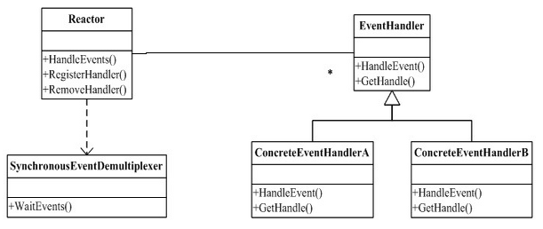

#反应器模式详解
##反应器模式设计类图

Ractor：Ractor模式的核心，一般作为事件的分发器，控制事件的调度方式，具备注册、删除具体事件。图中的Ractor通过Synchronous Event Demultiplexer来等待事件发生。一旦事件发生，会回调相应事件处理器。
EventHandle:事件处理器的抽象。由多个回调函数构成，构成相关事件的处理。
ConcreteEventHandleA:具体事件处理器。
Synchronous Event Demultiplexer(同步事件分离器)：一个系统调用，阻塞到有事件发生为止。对于Linux来说，同步事件分离器指的就是常用的I/O多路复用机制，比如说select、poll、epoll等。在Java NIO领域中，同步事件分离器对应的组件就是Selector；对应的阻塞方法就是select方法。
##参考出处
撰写本博客时用到的参考资料如下：
https://blog.csdn.net/baidu20008/article/details/4137876
https://www.cnblogs.com/winner-0715/p/8733787.html